# Review and check your Statuses

## About this file

This file was created by the Obsidian Tasks plugin (version 7.14.0) to help visualise the task statuses in this vault.

If you change the Tasks status settings, you can get an updated report by:

- Going to `Settings` -> `Tasks`.
- Clicking on `Review and check your Statuses`.

You can delete this file any time.

## Status Settings

<!--
Switch to Live Preview or Reading Mode to see the table.
If there are any Markdown formatting characters in status names, such as '*' or '_',
Obsidian may only render the table correctly in Reading Mode.
-->

These are the status values in the Core and Custom statuses sections.

| Status Symbol | Next Status Symbol | Status Name | Status Type | Problems (if any) |
| ----- | ----- | ----- | ----- | ----- |
| `space` | `x` | Todo | `TODO` |  |
| `x` | `space` | [done](kanban/done.md) | `[[[[done]]]]` |  |
| `/` | `x` | In Progress | `IN_PROGRESS` |  |
| `-` | `space` | Cancelled | `CANCELLED` |  |
| `space` | `x` | Unchecked | `TODO` | Duplicate symbol '`space`': this status will be ignored. |
| `x` | `space` | Checked | `[[[[done]]]]` | Duplicate symbol '`x`': this status will be ignored. |
| `>` | `x` | Rescheduled | `TODO` |  |
| `<` | `x` | Scheduled | `TODO` |  |
| `!` | `x` | Important | `TODO` |  |
| `?` | `x` | Question | `TODO` |  |
| `*` | `x` | Star | `TODO` |  |
| `n` | `x` | Note | `TODO` |  |
| `l` | `x` | Location | `TODO` |  |
| `i` | `x` | Information | `TODO` |  |
| `I` | `x` | Idea | `TODO` |  |
| `S` | `x` | Amount | `TODO` |  |
| `p` | `x` | Pro | `TODO` |  |
| `c` | `x` | Con | `TODO` |  |
| `b` | `x` | Bookmark | `TODO` |  |
| `"` | `x` | Quote | `TODO` |  |
| `0` | `0` | Speech bubble 0 | `NON_TASK` |  |
| `1` | `1` | Speech bubble 1 | `NON_TASK` |  |
| `2` | `2` | Speech bubble 2 | `NON_TASK` |  |
| `3` | `3` | Speech bubble 3 | `NON_TASK` |  |
| `4` | `4` | Speech bubble 4 | `NON_TASK` |  |
| `5` | `5` | Speech bubble 5 | `NON_TASK` |  |
| `6` | `6` | Speech bubble 6 | `NON_TASK` |  |
| `7` | `7` | Speech bubble 7 | `NON_TASK` |  |
| `8` | `8` | Speech bubble 8 | `NON_TASK` |  |
| `9` | `9` | Speech bubble 9 | `NON_TASK` |  |
| `space` | `x` | incomplete | `TODO` | Duplicate symbol '`space`': this status will be ignored. |
| `x` | `space` | complete / done | `DONE` | Duplicate symbol '`x`': this status will be ignored. |
| `-` | `space` | cancelled | `CANCELLED` | Duplicate symbol '`-`': this status will be ignored. |
| `>` | `x` | deferred | `TODO` | Duplicate symbol '`>`': this status will be ignored. |
| `/` | `x` | in progress, or half-[done](kanban/done.md) | `IN_PROGRESS` | Duplicate symbol '`/`': this status will be ignored. |
| `?` | `x` | question | `TODO` | Duplicate symbol '`?`': this status will be ignored. |
| `R` | `x` | review | `TODO` |  |
| `+` | `x` | Inbox / task that should be processed later | `TODO` |  |
| `b` | `x` | bookmark | `TODO` | Duplicate symbol '`b`': this status will be ignored. |
| `B` | `x` | brainstorm | `TODO` |  |
| `D` | `x` | deferred or scheduled | `TODO` |  |
| `I` | `x` | Info | `TODO` | Duplicate symbol '`I`': this status will be ignored. |
| `i` | `x` | idea | `TODO` | Duplicate symbol '`i`': this status will be ignored. |
| `N` | `x` | note | `TODO` |  |
| `Q` | `x` | quote | `TODO` |  |
| `W` | `x` | win / success / reward | `TODO` |  |
| `P` | `x` | pro | `TODO` |  |
| `C` | `x` | con | `TODO` |  |
| `space` | `x` | To Do | `TODO` | Duplicate symbol '`space`': this status will be ignored. |
| `x` | `space` | [done](kanban/done.md) | `[[[[done]]]]` | Duplicate symbol '`x`': this status will be ignored. |
| `i` | `x` | Infomation | `TODO` | Duplicate symbol '`i`': this status will be ignored. |
| `“` | `x` | Quote | `TODO` |  |
| `u` | `x` | Up | `TODO` |  |
| `d` | `x` | Down | `TODO` |  |
| `x` | `space` | Regular | `[[[[done]]]]` | Duplicate symbol '`x`': this status will be ignored. |
| `X` | `space` | Checked | `[[[[done]]]]` |  |
| `-` | `space` | Dropped | `CANCELLED` | Duplicate symbol '`-`': this status will be ignored. |
| `>` | `x` | Forward | `TODO` | Duplicate symbol '`>`': this status will be ignored. |
| `D` | `x` | Date | `TODO` | Duplicate symbol '`D`': this status will be ignored. |
| `/` | `x` | Half [done](kanban/done.md) | `IN_PROGRESS` | Duplicate symbol '`/`': this status will be ignored. |
| `+` | `x` | Add | `TODO` | Duplicate symbol '`+`': this status will be ignored. |
| `R` | `x` | Research | `TODO` | Duplicate symbol '`R`': this status will be ignored. |
| `i` | `x` | Idea | `TODO` | Duplicate symbol '`i`': this status will be ignored. |
| `B` | `x` | Brainstorm | `TODO` | Duplicate symbol '`B`': this status will be ignored. |
| `P` | `x` | Pro | `TODO` | Duplicate symbol '`P`': this status will be ignored. |
| `C` | `x` | Con | `TODO` | Duplicate symbol '`C`': this status will be ignored. |
| `Q` | `x` | Quote | `TODO` | Duplicate symbol '`Q`': this status will be ignored. |
| `N` | `x` | Note | `TODO` | Duplicate symbol '`N`': this status will be ignored. |
| `I` | `x` | Information | `TODO` | Duplicate symbol '`I`': this status will be ignored. |
| `p` | `x` | Paraphrase | `TODO` | Duplicate symbol '`p`': this status will be ignored. |
| `L` | `x` | Location | `TODO` |  |
| `E` | `x` | Example | `TODO` |  |
| `A` | `x` | Answer | `TODO` |  |
| `r` | `x` | Reward | `TODO` |  |
| `c` | `x` | Choice | `TODO` | Duplicate symbol '`c`': this status will be ignored. |
| `d` | `x` | Doing | `IN_PROGRESS` | Duplicate symbol '`d`': this status will be ignored. |
| `T` | `x` | Time | `TODO` |  |
| `@` | `x` | Character / Person | `TODO` |  |
| `t` | `x` | Talk | `TODO` |  |
| `O` | `x` | Outline / Plot | `TODO` |  |
| `~` | `x` | Conflict | `TODO` |  |
| `W` | `x` | World | `TODO` | Duplicate symbol '`W`': this status will be ignored. |
| `f` | `x` | Clue / Find | `TODO` |  |
| `F` | `x` | Foreshadow | `TODO` |  |
| `H` | `x` | Favorite / Health | `TODO` |  |
| `&` | `x` | Symbolism | `TODO` |  |
| `s` | `x` | Secret | `TODO` |  |
| `f` | `x` | Fire | `TODO` | Duplicate symbol '`f`': this status will be ignored. |
| `k` | `x` | Key | `TODO` |  |
| `w` | `x` | Win | `TODO` |  |
| `space` | `x` | [to-do](kanban/to-do.md) | `TODO` | Duplicate symbol '`space`': this status will be ignored. |
| `/` | `x` | incomplete | `IN_PROGRESS` | Duplicate symbol '`/`': this status will be ignored. |
| `x` | `space` | [done](kanban/done.md) | `[[[[done]]]]` | Duplicate symbol '`x`': this status will be ignored. |
| `-` | `space` | canceled | `CANCELLED` | Duplicate symbol '`-`': this status will be ignored. |
| `>` | `x` | forwarded | `TODO` | Duplicate symbol '`>`': this status will be ignored. |
| `<` | `x` | scheduling | `TODO` | Duplicate symbol '`<`': this status will be ignored. |
| `!` | `x` | important | `TODO` | Duplicate symbol '`!`': this status will be ignored. |
| `*` | `x` | star | `TODO` | Duplicate symbol '`*`': this status will be ignored. |
| `"` | `x` | quote | `TODO` | Duplicate symbol '`"`': this status will be ignored. |
| `l` | `x` | location | `TODO` | Duplicate symbol '`l`': this status will be ignored. |
| `i` | `x` | information | `TODO` | Duplicate symbol '`i`': this status will be ignored. |
| `S` | `x` | savings | `TODO` | Duplicate symbol '`S`': this status will be ignored. |
| `I` | `x` | idea | `TODO` | Duplicate symbol '`I`': this status will be ignored. |
| `p` | `x` | pros | `TODO` | Duplicate symbol '`p`': this status will be ignored. |
| `c` | `x` | cons | `TODO` | Duplicate symbol '`c`': this status will be ignored. |
| `f` | `x` | fire | `TODO` | Duplicate symbol '`f`': this status will be ignored. |
| `k` | `x` | key | `TODO` | Duplicate symbol '`k`': this status will be ignored. |
| `w` | `x` | win | `TODO` | Duplicate symbol '`w`': this status will be ignored. |
| `u` | `x` | up | `TODO` | Duplicate symbol '`u`': this status will be ignored. |
| `d` | `x` | down | `TODO` | Duplicate symbol '`d`': this status will be ignored. |

## Loaded Settings

<!-- Switch to Live Preview or Reading Mode to see the diagram. -->

These are the settings actually used by Tasks.

```mermaid
flowchart LR

classDef TODO        stroke:#f33,stroke-width:3px;
classDef DONE        stroke:#0c0,stroke-width:3px;
classDef IN_PROGRESS stroke:#fa0,stroke-width:3px;
classDef CANCELLED   stroke:#ddd,stroke-width:3px;
classDef NON_TASK    stroke:#99e,stroke-width:3px;

1["'Todo'<br>[ ] -> [x]<br>(TODO)"]:::TODO
2["'Done'<br>[x] -> [ ]<br>(DONE)"]:::DONE
3["'In Progress'<br>[/] -> [x]<br>(IN_PROGRESS)"]:::IN_PROGRESS
4["'Cancelled'<br>[-] -> [ ]<br>(CANCELLED)"]:::CANCELLED
5["'Rescheduled'<br>[&gt;] -> [x]<br>(TODO)"]:::TODO
6["'Scheduled'<br>[&lt;] -> [x]<br>(TODO)"]:::TODO
7["'Important'<br>[!] -> [x]<br>(TODO)"]:::TODO
8["'Question'<br>[?] -> [x]<br>(TODO)"]:::TODO
9["'Star'<br>[*] -> [x]<br>(TODO)"]:::TODO
10["'Note'<br>[n] -> [x]<br>(TODO)"]:::TODO
11["'Location'<br>[l] -> [x]<br>(TODO)"]:::TODO
12["'Information'<br>[i] -> [x]<br>(TODO)"]:::TODO
13["'Idea'<br>[I] -> [x]<br>(TODO)"]:::TODO
14["'Amount'<br>[S] -> [x]<br>(TODO)"]:::TODO
15["'Pro'<br>[p] -> [x]<br>(TODO)"]:::TODO
16["'Con'<br>[c] -> [x]<br>(TODO)"]:::TODO
17["'Bookmark'<br>[b] -> [x]<br>(TODO)"]:::TODO
18["'Quote'<br>[&quot;] -> [x]<br>(TODO)"]:::TODO
19["'Speech bubble 0'<br>[0] -> [0]<br>(NON_TASK)"]:::NON_TASK
20["'Speech bubble 1'<br>[1] -> [1]<br>(NON_TASK)"]:::NON_TASK
21["'Speech bubble 2'<br>[2] -> [2]<br>(NON_TASK)"]:::NON_TASK
22["'Speech bubble 3'<br>[3] -> [3]<br>(NON_TASK)"]:::NON_TASK
23["'Speech bubble 4'<br>[4] -> [4]<br>(NON_TASK)"]:::NON_TASK
24["'Speech bubble 5'<br>[5] -> [5]<br>(NON_TASK)"]:::NON_TASK
25["'Speech bubble 6'<br>[6] -> [6]<br>(NON_TASK)"]:::NON_TASK
26["'Speech bubble 7'<br>[7] -> [7]<br>(NON_TASK)"]:::NON_TASK
27["'Speech bubble 8'<br>[8] -> [8]<br>(NON_TASK)"]:::NON_TASK
28["'Speech bubble 9'<br>[9] -> [9]<br>(NON_TASK)"]:::NON_TASK
29["'review'<br>[R] -> [x]<br>(TODO)"]:::TODO
30["'Inbox / task that should be processed later'<br>[+] -> [x]<br>(TODO)"]:::TODO
31["'brainstorm'<br>[B] -> [x]<br>(TODO)"]:::TODO
32["'deferred or scheduled'<br>[D] -> [x]<br>(TODO)"]:::TODO
33["'note'<br>[N] -> [x]<br>(TODO)"]:::TODO
34["'quote'<br>[Q] -> [x]<br>(TODO)"]:::TODO
35["'win / success / reward'<br>[W] -> [x]<br>(TODO)"]:::TODO
36["'pro'<br>[P] -> [x]<br>(TODO)"]:::TODO
37["'con'<br>[C] -> [x]<br>(TODO)"]:::TODO
38["'Quote'<br>[“] -> [x]<br>(TODO)"]:::TODO
39["'Up'<br>[u] -> [x]<br>(TODO)"]:::TODO
40["'Down'<br>[d] -> [x]<br>(TODO)"]:::TODO
41["'Checked'<br>[X] -> [ ]<br>(DONE)"]:::DONE
42["'Location'<br>[L] -> [x]<br>(TODO)"]:::TODO
43["'Example'<br>[E] -> [x]<br>(TODO)"]:::TODO
44["'Answer'<br>[A] -> [x]<br>(TODO)"]:::TODO
45["'Reward'<br>[r] -> [x]<br>(TODO)"]:::TODO
46["'Time'<br>[T] -> [x]<br>(TODO)"]:::TODO
47["'Character / Person'<br>[@] -> [x]<br>(TODO)"]:::TODO
48["'Talk'<br>[t] -> [x]<br>(TODO)"]:::TODO
49["'Outline / Plot'<br>[O] -> [x]<br>(TODO)"]:::TODO
50["'Conflict'<br>[~] -> [x]<br>(TODO)"]:::TODO
51["'Clue / Find'<br>[f] -> [x]<br>(TODO)"]:::TODO
52["'Foreshadow'<br>[F] -> [x]<br>(TODO)"]:::TODO
53["'Favorite / Health'<br>[H] -> [x]<br>(TODO)"]:::TODO
54["'Symbolism'<br>[&amp;] -> [x]<br>(TODO)"]:::TODO
55["'Secret'<br>[s] -> [x]<br>(TODO)"]:::TODO
56["'Key'<br>[k] -> [x]<br>(TODO)"]:::TODO
57["'Win'<br>[w] -> [x]<br>(TODO)"]:::TODO
1 --> 2
2 --> 1
3 --> 2
4 --> 1
5 --> 2
6 --> 2
7 --> 2
8 --> 2
9 --> 2
10 --> 2
11 --> 2
12 --> 2
13 --> 2
14 --> 2
15 --> 2
16 --> 2
17 --> 2
18 --> 2
19 --> 19
20 --> 20
21 --> 21
22 --> 22
23 --> 23
24 --> 24
25 --> 25
26 --> 26
27 --> 27
28 --> 28
29 --> 2
30 --> 2
31 --> 2
32 --> 2
33 --> 2
34 --> 2
35 --> 2
36 --> 2
37 --> 2
38 --> 2
39 --> 2
40 --> 2
41 --> 1
42 --> 2
43 --> 2
44 --> 2
45 --> 2
46 --> 2
47 --> 2
48 --> 2
49 --> 2
50 --> 2
51 --> 2
52 --> 2
53 --> 2
54 --> 2
55 --> 2
56 --> 2
57 --> 2

linkStyle default stroke:gray
```

